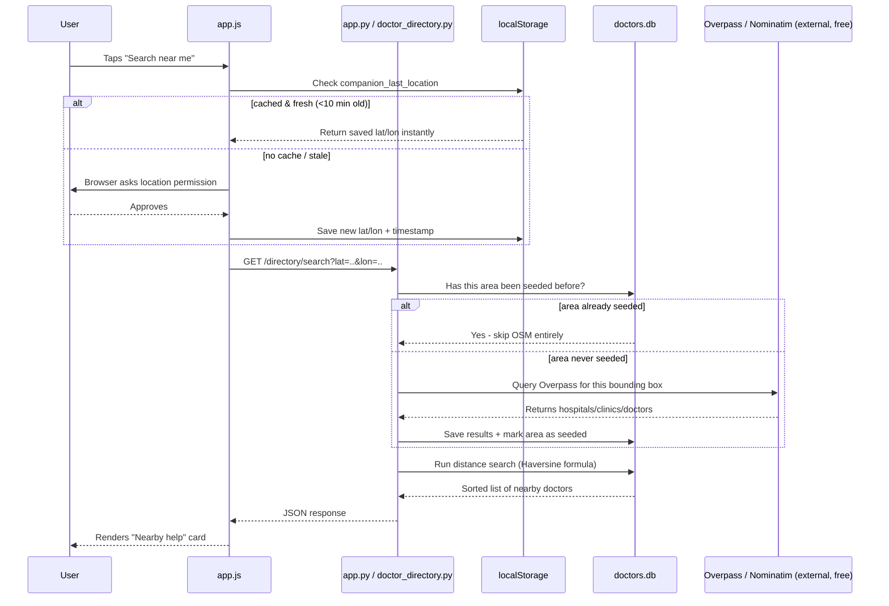

# Nearby Doctor Finder — How It Works

This doc explains the "find nearby doctors/hospitals" feature in Smart Companion: what OpenStreetMap is, why we built it this way, the full request flow, and a walkthrough of the actual code. Read top to bottom — each section builds on the last.

---

## 1. The building blocks, explained plainly

**OpenStreetMap (OSM)** is a free, crowd-edited map of the entire planet — think "Wikipedia for maps." Anyone can add a hospital, road, or shop to it. All of that data is public, free, and already covers *every* place on Earth — nobody has to manually add data city-by-city for us to use it.

**Overpass API** is the query engine in front of OSM's raw data. We send it a question like *"give me every hospital/clinic/dentist inside this rectangle of coordinates,"* and it searches OSM's full dataset and returns matches as JSON. It's free, but it's a **shared public resource** — rate-limited, sometimes slow, occasionally times out (504 errors). We are polite guests on someone else's free server.

**Nominatim** is OSM's free geocoding service — it converts a place name ("Park Street, Kolkata") into coordinates (lat/lon). Same free, no-key, shared-resource situation as Overpass.

**Our own local database (`doctors.db`, SQLite)** is where we **copy** OSM data into, once, so we're not hitting Overpass on every single user request. This is the single most important design decision in the whole feature — see Section 3.

---

## 2. Why not just call Overpass live, every time?

Because Overpass is shared, free infrastructure — hitting it on every user search would be:
- **Slow** (a live query takes a few seconds, sometimes much longer or times out)
- **Rude** — we'd be hammering a free resource meant to be used sparingly
- **Fragile** — if Overpass is down or slow, our whole feature breaks

So instead: **copy the data we need into our own fast local database, once, and answer from that copy afterward.** This is a standard caching pattern — and we actually use it *twice* in this feature, at two different layers. That's the key idea to hold onto for the rest of this doc.

---

## 3. The two caches — don't confuse them

| | What it caches | Where it lives | Why |
|---|---|---|---|
| **Area cache** | *OSM's data about places* (which doctors/hospitals exist where) | Backend: `doctors.db` + `seeded_areas` table | Avoid re-asking Overpass about the same geographic area twice |
| **Location cache** | *The user's own GPS position* | Frontend: browser `localStorage` | Avoid re-asking the phone's GPS hardware (and re-prompting permission) every single time |

Same general idea (cache instead of re-fetch), but solving two completely different problems. Keep this table in your head — most confusion comes from mixing these two up.

---

## 4. Full request flow (step by step)



**In plain words:** the frontend asks "where is the user" (cached if recent), the backend asks "do I already know this area" (seeded if searched before), and only on a genuine first-time miss does anything touch the free OSM services at all.

---

## 5. Code walkthrough — `doctor_directory.py`

### `init_db()`
Creates three tables on startup:
- `doctors` — the actual seeded/registered doctor records
- `appointment_requests` — logs of booking requests (sent via WhatsApp link, not a real booking system)
- `seeded_areas` — tracks which geographic circles we've already pulled from OSM, so we never redo it

### `seed_from_osm(south, west, north, east)`
Takes a bounding box, builds an Overpass query string, tries **three different Overpass mirror servers** in sequence (since the public ones occasionally time out), and inserts results into `doctors` using `INSERT OR IGNORE` (so re-running this never creates duplicates).

### `ensure_area_seeded(lat, lon, radius_km)` — the heart of the auto-seeding
```python
def ensure_area_seeded(lat, lon, radius_km=5):
    if _area_already_covered(lat, lon):
        return {"newly_seeded": False}   # already have this area - do nothing

    # Not covered yet - pull it from OSM, auto-shrinking the radius
    # if the area is too dense/large and times out.
    ...
    _mark_area_seeded(lat, lon, radius_km)
```
This is called at the **top of every `/search`**, automatically. Nobody has to manually pre-seed a city anymore — the first real user search in any area triggers it transparently.

### `/search` endpoint
```python
@router.get("/search")
def search(lat, lon, specialty="", radius_km=5, limit=10):
    ensure_area_seeded(lat, lon, radius_km)   # instant if cached, one-time OSM pull otherwise
    # ...then just queries our own local doctors.db with Haversine distance math
```

### `/geocode` endpoint
Thin wrapper around Nominatim — turns a typed place name into lat/lon, so a user can search "Ballygunge" instead of only using their live GPS.

### `seed_by_place(place, radius_km)`
A **manual** seeding tool (geocode a name → seed that box directly). Mainly useful for **pre-seeding your demo city before a live presentation**, so the first search doesn't visibly stall waiting on Overpass in front of an audience.

---

## 6. Code walkthrough — `app.js`

### `getCachedOrFreshLocation(maxAgeMs)`
```js
function getCachedOrFreshLocation(maxAgeMs = 10 * 60 * 1000) {
  // 1. Check localStorage - if a saved position is younger than maxAgeMs, return it instantly
  // 2. Otherwise, call navigator.geolocation.getCurrentPosition() for real,
  //    then save the result + timestamp for next time
}
```
Used with **two different time windows**, deliberately:
- `searchNearbyByGeolocation()` → trusts a cached fix for **10 minutes** (routine lookup, speed matters more)
- `showEmergencyPanel()` → trusts a cached fix for only **2 minutes** (emergency, freshness matters more)

### `maybeShowNearbyHealthcare()`
Fires after every normal medical-session answer. Only shows the "want nearby listings?" prompt if `currentLabel === 'medical'` — never interrupts cooking/travel/exam sessions.

### `showEmergencyPanel()`
Triggered either by tapping the 🆘 button manually, or automatically when the backend's deterministic `triage.py` keyword check flags a message as an emergency. Shows one-tap `tel:108`/`tel:104` links plus the single nearest seeded facility.

---

## 7. Honest limitations 

- **OSM data isn't verified.** Anyone can edit it — a phone number could be outdated. This is *why* the `verified` flag and manual-verification workflow exist in `doctors.db`.
- **No uptime guarantee on Overpass/Nominatim.** They're free, shared, and can go down or slow down with zero warning — that's why we minimize live dependency on them via the caching layers above.
- **Attribution is legally required**, not optional — OSM's ODbL license requires the `© OpenStreetMap contributors` credit line visible somewhere in the app (already added in the footer).
- **The very first search in a brand-new area is genuinely slow** (a real Overpass round-trip, a few seconds to tens of seconds) — every search after that, in the same area, is instant. This is expected behavior, not a bug.

---

## 8. One-sentence summary for anyone who only reads one line

> We don't fetch live map data on every search — we fetch it once per area (cached server-side) and once per location-check (cached client-side), and OpenStreetMap/Overpass/Nominatim only ever get contacted on a genuine first-time miss in either cache.
